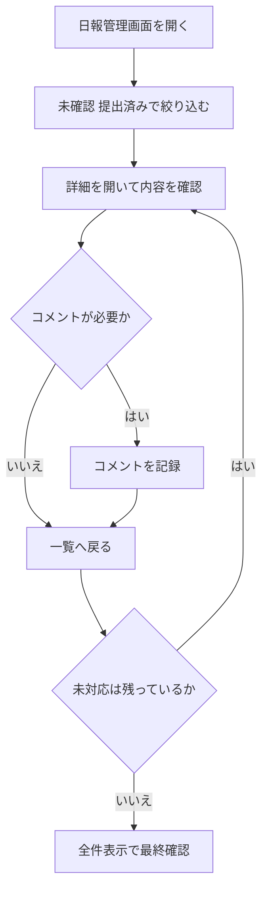

# 日報を管理する

このページでは、スタッフの日報を確認して、未対応を減らす手順を説明します。

## この画面の目的

- 日報の提出状況を一覧で把握する
- 未確認、提出済みを優先して対応する
- コメントで確認内容を残す

## 日次の手順

1. 日報管理画面を開く
1. 未確認、提出済みで絞り込む
1. 詳細を開いて内容を確認する
1. 必要な連絡事項をコメントする
1. 一覧に戻って未対応件数を確認する

## 日次運用フロー図

日報確認を繰り返すときの流れは、以下のとおりです。

## 確認するときのポイント

- 誰の日報か
- 対象日が合っているか
- コメントが必要か
- 返信や追記が来ていないか

## 注意点

- 未確認、提出済みを先に対応します。
- 絞り込みが残ると見落としやすいため、最後に全件表示で確認します。
- コメント前に、対象スタッフと対象日を再確認します。

## 関連導線

- 全体の入口: [ダッシュボードを確認する](./dashboard.md)
- 勤怠の運用方針: [勤怠を管理する](./attendance-management.md)
- 画面遷移の全体像: [画面遷移マップ](./navigation-map.md)
- 管理者向けの一覧: [管理者向けドキュメント](./overview.md)
