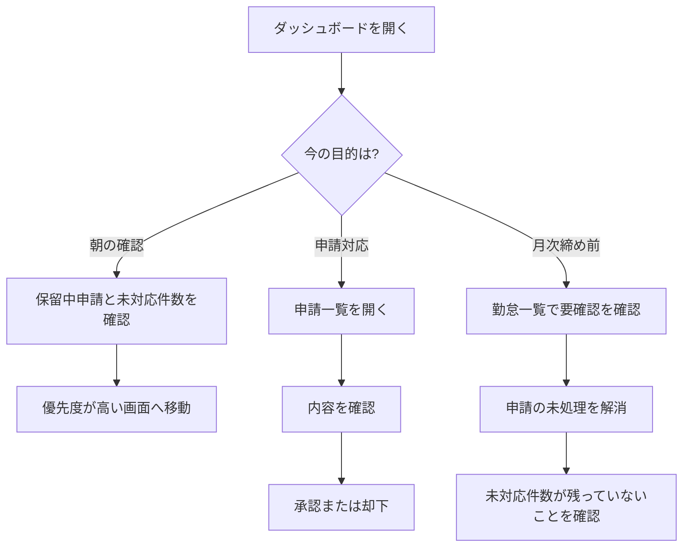

# 画面遷移マップ（管理者向け）

迷ったときに、目的から行き先を決めるためのページです。

## 目的から選ぶ

| したいこと                 | 開くページ                                     | 完了の目安                     |
| -------------------------- | ---------------------------------------------- | ------------------------------ |
| その日の優先対応を決めたい | [ダッシュボードを確認する](./dashboard.md)     | 優先作業を決められる           |
| 要確認データを減らしたい   | [勤怠一覧を確認する](./attendances.md)         | 未処理件数が減る               |
| 修正申請を処理したい       | [申請を承認する](./request-approval.md)        | 承認または却下が完了する       |
| 日報の未対応を減らしたい   | [日報を管理する](./daily-report.md)            | 未確認件数が減る               |
| 操作履歴を確認したい       | [操作ログを確認する](./operation-logs.md)      | いつ誰が何をしたか分かる       |
| 設定を見直したい           | [設定画面を管理する](./settings-management.md) | 変更内容と確認先を判断できる   |
| スタッフ情報を更新したい   | [スタッフを管理する](./staff-management.md)    | 対象アカウントの更新が完了する |

## 導線フロー図

朝の確認、申請対応、月次締め前確認の代表的な導線を図にまとめています。

## 最短ルート

### 朝の確認

1. ダッシュボードを開く
1. 保留中申請と未対応件数を確認する
1. 優先度が高い画面へ移動する

### 申請対応

1. 申請一覧を開く
1. 内容を確認する
1. 承認または却下する

### 月次締め前

1. 勤怠一覧で要確認を確認する
1. 申請の未処理をなくす
1. 未対応件数が残っていないことを確認する

### 設定を見直す

1. 設定画面を開く
1. 変更したいカテゴリと影響範囲を確認する
1. 変更後に関連画面で反映を確認する
