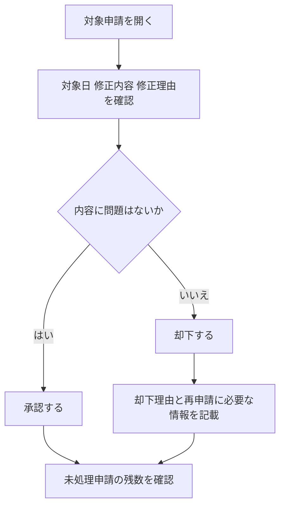

# 申請を承認する

このページでは、管理者が勤怠修正申請を確認し、承認・却下する手順を説明します。

## 対象となる申請

- 打刻漏れの修正申請
- 時刻誤りの修正申請
- 休憩時間の修正申請

## 手順

1. 管理画面の申請導線から対象申請を開く
1. 対象日・修正内容・修正理由を確認する
1. 承認または却下を実行する

## 承認フロー図

以下の図は、申請確認から承認・却下後の対応までを示したものです。

## 優先順位例

1. 締め日が近い申請
1. 長期間滞留している申請
1. 同一スタッフから複数日分の申請

## 承認時の確認ポイント

- 打刻時刻と休憩時刻の整合性
- 修正理由の妥当性
- 他申請との重複や未処理の有無

## 却下時のガイド

- 却下理由は具体的に記載する
- 再申請時に必要な情報を明示する
- 却下後のフォロー期限をチーム内で決める

## 運用の目安

- 毎日1回以上、申請の滞留がないか確認する
- 月次締め前は優先的に未処理申請を解消する
