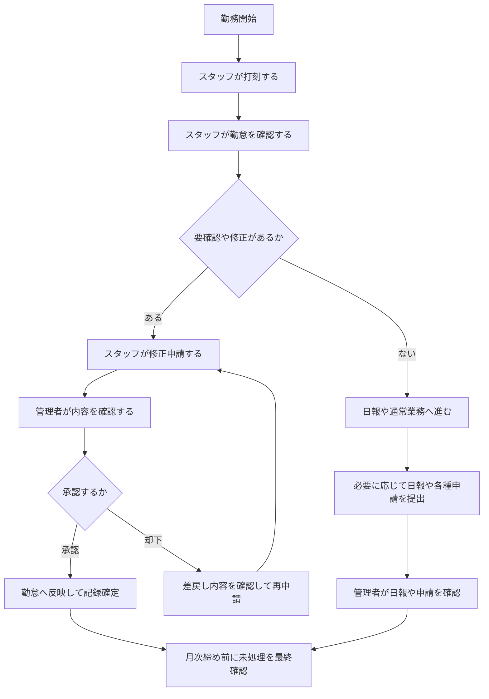

# 勤怠・関連申請の業務フロー全体像

このページは、スタッフと管理者をまたぐ勤怠業務の全体像を、日々の流れに沿って整理するためのハブです。
各画面の詳しい操作方法ではなく、誰が、どの順で、何を確認し、どこで分岐するかをまとめます。

用語やステータスの前提を先に確認したい場合は、[用語集](./terminology) と [勤務ステータスの見方](./work-status-overview) を参照してください。

## 最初に全体像をつかむ

## 1. 日次の基本フロー

日々の勤怠運用は、スタッフ側では `打刻 → 確認 → 必要なら申請`、管理者側では `確認 → 判断 → 未処理解消` の流れで進みます。

| 段階 | スタッフの主な動き | 管理者の主な動き | 完了の目安 |
| --- | --- | --- | --- |
| 勤務開始時 | [出退勤を打刻する](./staff/time-recording) | 必要に応じて当日の全体状況を確認する | 出勤時刻が記録される |
| 勤務中 | 休憩開始、休憩終了、退勤を打刻する | 申請中や要確認の件数を確認する | その時点の勤務状態に応じた打刻ができる |
| 退勤後から翌営業日 | [勤怠を確認する](./staff/attendance-check) | [勤怠を管理する](./admin/attendance-management) | 当日分の記録不足や不整合の有無が分かる |
| 問題があったとき | [勤怠を修正する](./staff/attendance-edit) | [申請を承認する](./admin/request-approval) | 申請中または承認済みになる |

### 日次で見るべき判断ポイント

- 打刻画面では、今押せる操作を示す `現在の勤務ステータス` を見る
- 勤怠一覧では、その日の記録状態を示す `勤怠判定ステータス` を見る
- `要確認` は修正や事実確認が必要な状態
- `申請中` はスタッフが申請済みで、管理者の判断待ちの状態

## 2. 勤怠修正と承認のフロー

勤怠修正は、スタッフが内容を補完し、管理者が妥当性を判断して完了します。
このフローでは、申請理由と時刻整合性の確認が中心になります。

| 段階 | スタッフの主な動き | 管理者の主な動き | 完了の目安 |
| --- | --- | --- | --- |
| 要確認の検知 | [勤怠一覧](./staff/attendance-check) で対象日を見つける | [勤怠一覧](./admin/attendances) で要確認や申請中を抽出する | 対応対象の日付が特定できる |
| 修正入力 | 勤務時間、休憩、直行・直帰、休暇などを見直す | 必要に応じて事実確認を進める | 申請に必要な入力がそろう |
| 申請 | 修正理由を記載して提出する | 申請一覧や対象勤怠から詳細を開く | 対象日の状態が `申請中` になる |
| 承認判断 | 承認待ちとして経過を確認する | 修正内容、理由、休憩、他申請との重複を確認する | 承認または却下が実行される |
| 差戻し対応 | 却下理由を確認し、必要な内容を修正して再申請する | 却下理由と再申請に必要な情報を残す | `OK` または再申請待ちになる |

### よくある修正対象

- 出勤や退勤の打刻漏れ
- 休憩時間の不足や重複
- 直行・直帰の記録誤り
- 有給休暇、特別休暇、振替休日、時間単位休暇の申請内容見直し

## 3. 日報のフロー

日報は勤怠そのものの確定処理ではありませんが、日次業務の中で並行して扱うことが多い関連フローです。

| 段階 | スタッフの主な動き | 管理者の主な動き | 完了の目安 |
| --- | --- | --- | --- |
| 対象日確認 | [日報を記録する](./staff/attendance-report) で対象日を選ぶ | [日報を管理する](./admin/daily-report) で提出状況を確認する | 対象日が一致している |
| 入力 | 件名、本文、進捗、課題を記載する | 必要に応じて未確認や提出済みを優先して開く | 内容が確認できる状態になる |
| 保存と提出 | 下書き保存または提出する | 詳細を確認し、必要ならコメントする | 下書きまたは提出済みとして扱える |
| 提出後対応 | コメントや差戻し相当の指摘があれば更新する | 未対応件数が減っているか確認する | 状態確認と必要な追記が完了する |

## 4. ワークフロー申請のフロー

ワークフロー申請は、勤怠修正とは別系統の申請フローです。
有給休暇、欠勤、残業、打刻修正系の申請を、一覧、詳細、コメントを通して処理します。

| 段階 | スタッフの主な動き | 管理者の主な動き | 完了の目安 |
| --- | --- | --- | --- |
| 新規作成 | [ワークフロー申請を操作する](./staff/workflow) から申請を作成する | [ワークフロー申請を管理する](./admin/workflow) で新着申請を確認する | 申請内容が作成される |
| 下書きまたは提出 | 下書き保存または正式提出する | 種別やステータスで絞り込む | `下書き` または `承認待ち` になる |
| 確認 | 一覧や詳細で状態、承認フロー、コメントを確認する | 詳細で申請内容、日付、理由、コメント履歴を確認する | 判断材料がそろう |
| 承認または却下 | 必要ならコメントに対応し、再提出する | 承認または却下を実行する | `承認済`、`却下`、`キャンセル` のいずれかになる |

### 勤怠修正申請との違い

- 勤怠修正申請は、特定日の勤怠レコードを直接補正する流れ
- ワークフロー申請は、申請カテゴリごとに一覧、詳細、承認フローを持つ汎用申請の流れ
- `打刻修正` という名称の申請カテゴリがあっても、運用上どちらの導線を使うかは画面起点で判断する

## 5. 月次締め前のフロー

月次締め前は、日々の確認をまとめて見直し、未処理を残さないことが目的になります。

| 段階 | スタッフの主な動き | 管理者の主な動き | 完了の目安 |
| --- | --- | --- | --- |
| 対象月の確認 | 対象月の勤怠一覧を開く | 対象月の勤怠一覧やダッシュボードを開く | 確認対象期間がそろう |
| 未処理の洗い出し | `要確認` と `申請中` を優先して確認する | 申請中、要確認、未確認日報を優先順で確認する | 未処理の一覧が見える |
| 解消対応 | 必要な修正申請や再申請を行う | 承認、却下、コメントを通じて未処理を減らす | 未処理件数が減る |
| 最終確認 | 承認結果と時刻反映を確認する | 未処理申請や欠落データが残っていないことを確認する | 月次確認に進める状態になる |

## どこから読めばよいか

- スタッフとして日々の流れを確認したい場合: [基本操作](./staff/basic-operations)
- スタッフとして画面導線から探したい場合: [画面遷移マップ（スタッフ向け）](./staff/navigation-map)
- 管理者として優先度順に対応したい場合: [勤怠を管理する](./admin/attendance-management)
- 管理者として画面単位で確認したい場合: [画面遷移マップ（管理者向け）](./admin/navigation-map)
- 画面名から横断的に探したい場合: [画面一覧](./screen-list)
