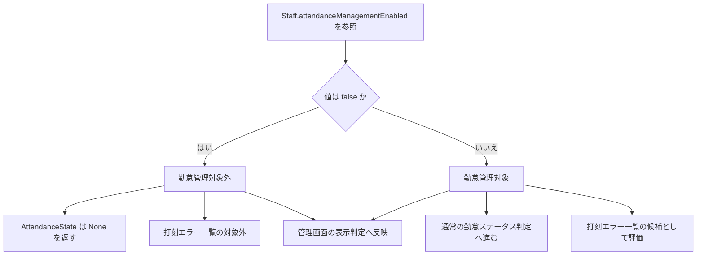

# 勤怠管理対象フラグ仕様

このページは、スタッフ単位の勤怠管理対象フラグ（`attendanceManagementEnabled`）の仕様をまとめる。

## 目的

勤怠管理対象フラグ（`attendanceManagementEnabled`）は、特定スタッフを勤怠管理対象に含めるかどうかを制御する。

- `true` の場合: 勤怠管理対象
- `false` の場合: 勤怠管理対象外
- `null` / 未設定の場合: 勤怠管理対象（`true` と同等）

## 保存先

このフラグはアプリ設定（AppConfig）ではなく、スタッフ（Staff）モデルの属性として保持される。

- GraphQL 定義: `amplify/backend/api/garakufrontend/schema.graphql`
- フィールド: `Staff.attendanceManagementEnabled: Boolean`

## 判定ロジック

判定処理は判定ヘルパー `isAttendanceManagementEnabled()` に集約されている。

```ts
return staff?.attendanceManagementEnabled !== false;
```

このため、明示的に `false` が設定された場合のみ勤怠管理対象外となる。

| 値                   | 判定結果       |
| -------------------- | -------------- |
| `true`               | 勤怠管理対象   |
| `false`              | 勤怠管理対象外 |
| `null` / `undefined` | 勤怠管理対象   |

## 判定と影響範囲のフロー図

フラグ値の正規化と各機能への波及先をまとめると、以下の流れになる。



実装箇所:

- `src/entities/staff/lib/attendanceManagement.ts`

## 正規化

正規化ヘルパー `normalizeAttendanceManagementEnabled()` は、未設定値を含むスタッフデータを扱う際に、`attendanceManagementEnabled` を boolean に正規化する。

- 目的: 表示や保存処理で三値（`true` / `false` / `null`）を直接扱わないようにする
- 実装: `src/entities/staff/lib/attendanceManagement.ts`

## 影響範囲

### 1. 勤怠ステータス判定

勤怠状態判定（`AttendanceState.get()`）は、フラグが勤怠管理対象外のスタッフに対して早期に `AttendanceStatus.None` を返す。

- 実装: `src/entities/attendance/lib/AttendanceState.ts`

### 2. 打刻エラー一覧の表示

打刻エラー一覧の表示対象スタッフは、勤怠管理対象フラグで制御される。

- 仕様詳細: [打刻エラー一覧の表示仕様](./attendance-error-list-display.md)

### 3. 管理画面のスタッフ一覧表示

管理者向けスタッフ管理画面では、勤怠管理対象かどうかの表示にこの判定を利用している。

- 実装: `src/features/admin/staff/ui/AdminStaff.tsx`

## 実装時の注意

- 新規実装で判定が必要な場合は、`staff.attendanceManagementEnabled` を直接読むのではなく `isAttendanceManagementEnabled()` を利用する。
- これにより、未設定値を勤怠管理対象として扱う既存仕様を一貫して維持できる。

## 参考テスト

- `src/entities/staff/lib/__tests__/attendanceManagement.test.ts`
- `src/entities/attendance/lib/__tests__/AttendanceState.test.ts`

上記テストで、以下が担保されている。

- `false` のときのみ勤怠管理対象外
- `null` / 未設定は勤怠管理対象
- 勤怠管理対象外のときは `AttendanceStatus.None`
