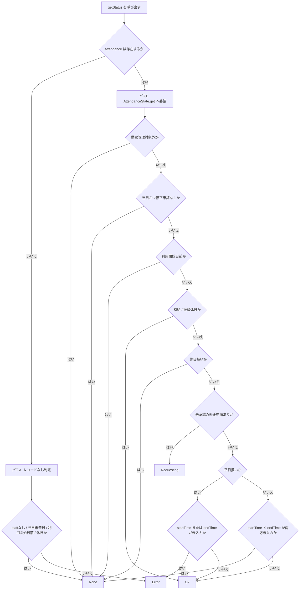
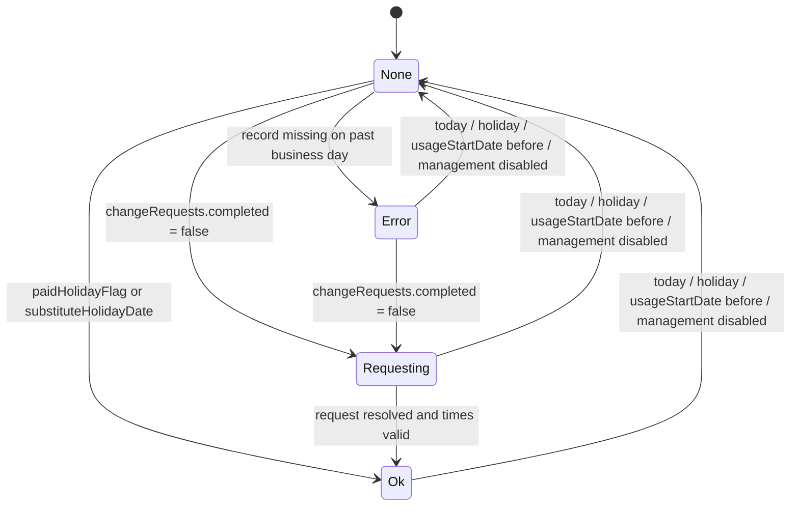

# 勤怠ステータス判定ロジック

スタッフの 1 日分の勤怠ステータスを返す中核ライブラリの仕様を定義する。

このページは、勤怠一覧や集計で使う「勤怠判定ステータス」を対象にした仕様ページです。打刻画面で使う「現在の勤務ステータス」は別概念であり、共通整理は [勤務ステータスの見方](../work-status-overview.md) を参照してください。

## エントリーポイント: `getStatus()`

**ファイル**: `src/features/attendance/list/lib/attendanceStatusUtils.ts`

```
getStatus(attendance, staff, holidayCalendars, companyHolidayCalendars, date)
  → AttendanceStatus
```

勤怠レコードの有無で 2 つのパスに分岐する。

## 判定フロー図

全体の分岐と主要な到達ステータスを先に把握したい場合は、以下のフローを参照する。



---

## 代表的な状態変化

内部実装の全条件は上のフロー図が正本です。以下は `AttendanceStatus` の見え方を、代表的な変化に絞って整理した図です。



`Working` は打刻画面側の現在状態であり、この図の主対象外です。

`Late` は将来拡張用で、現状は `Error` ルートとして扱います。

---

## パス A: 勤怠レコードが存在しない日（`attendance = undefined`）

以下の順序で判定し、最初にマッチした条件で返す。

| 優先度 | 条件                                                | 返り値  |
| ------ | --------------------------------------------------- | ------- |
| 1      | `staff` が `null` / `undefined`                     | `None`  |
| 2      | 当日または未来日                                    | `None`  |
| 3      | `usageStartDate` が設定されており、その日より前     | `None`  |
| 4      | 非シフト勤務 かつ `isHolidayLike()` が `true`（※1） | `None`  |
| —      | 上記いずれにも該当しない（過去の営業日）            | `Error` |

> **※1 シフト勤務の場合**: `isHolidayLike()` チェックをスキップするため、祝日・週末であっても `Error` が返る。

### `isHolidayLike()` の判定内容

| 勤務形態     | `true` となる条件                                      |
| ------------ | ------------------------------------------------------ |
| シフト勤務   | 祝日 **または** 会社休日                               |
| 非シフト勤務 | 祝日 **または** 会社休日 **または** 土日（日=0, 土=6） |

---

## パス B: 勤怠レコードが存在する日（`attendance` あり）

`AttendanceState.get()` に委譲する。

**ファイル**: `src/entities/attendance/lib/AttendanceState.ts`

以下の順序で判定し、最初にマッチした条件で返す。

| 優先度 | 条件                                                                        | 返り値       |
| ------ | --------------------------------------------------------------------------- | ------------ |
| 1      | `attendanceManagementEnabled === false`                                     | `None`       |
| 2      | 当日 かつ 修正申請なし                                                      | `None`       |
| 3      | `usageStartDate` が設定されており、その日より前                             | `None`       |
| 4      | 有給休暇（`paidHolidayFlag`）または 振替休日（`substituteHolidayDate`）     | `Ok`         |
| 5      | シフト勤務 かつ `isDeemedHoliday`、または 非シフト勤務 かつ 祝日 / 会社休日 | `None`       |
| 6      | 未承認の修正申請あり（`changeRequests` に `completed = false` が 1 件以上） | `Requesting` |
| 7      | 平日判定（※2）が `true` かつ `startTime` または `endTime` が未入力          | `Error`      |
| 8      | 平日判定が `true` かつ 出退勤とも入力済み                                   | `Ok`         |
| 9      | 非平日（週末など）かつ `startTime` と `endTime` が両方とも未入力            | `None`       |
| 10     | 非平日（週末など）かつ いずれかが入力済み                                   | `Ok`         |

> **※2 平日判定**:
>
> - シフト勤務（`isDeemedHoliday` でない）: 曜日に関わらず常に `true`
> - 非シフト勤務: `DayOfWeek.isWeekday(workDate)` を使用（祝日は非平日扱い）

### `isLate()` と `isWorking()`

優先度 7 の「`startTime` または `endTime` が未入力」は下記の判定に相当する。

- `isLate()` = `startTime` が未入力
- `isWorking()` = `endTime` が未入力

---

## ステータス一覧

| ステータス   | 値         | 意味                                                                   |
| ------------ | ---------- | ---------------------------------------------------------------------- |
| `Ok`         | `"OK"`     | 正常（出退勤入力済み、または休日・有給等）                             |
| `Error`      | `"Error"`  | 出勤時刻または退勤時刻が未入力の平日、またはレコードが存在しない営業日 |
| `Requesting` | `"申請中"` | 未承認の修正申請あり                                                   |
| `Late`       | `"遅刻"`   | 将来的な拡張用。現時点では `Error` と同ルートで返される                |
| `Working`    | `"勤務中"` | 出勤済み・退勤前（打刻画面で使用）                                     |
| `None`       | `""`       | 判定対象外（当日・休日・未設定期間・勤怠管理無効など）                 |

---

## 関連ドキュメント

- [勤務ステータスの見方](../work-status-overview.md) — 現在の勤務ステータスと勤怠判定ステータスの共通整理
- [打刻エラー一覧の表示仕様](./attendance-error-list-display.md) — 一覧画面上での収集・表示条件
- [attendanceManagementEnabled フラグ仕様](./attendance-management-enabled.md) — 勤怠管理の有効・無効フラグ
- [休憩時間仕様](./break-time-specification.md) — 打刻時自動追加と表示時仮控除の違い
