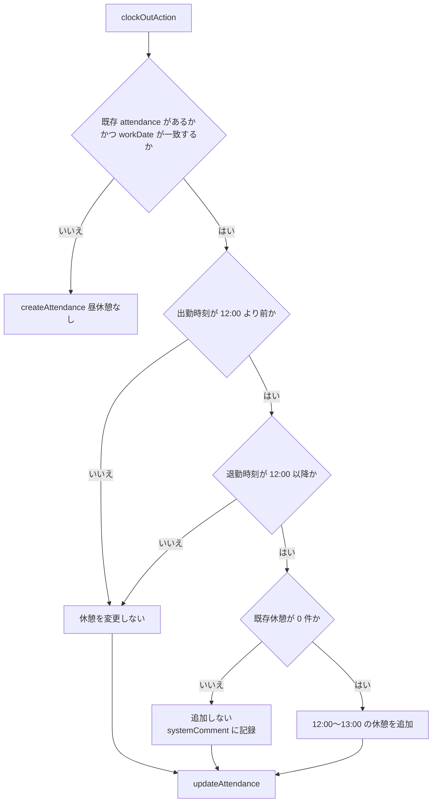

# 休憩時間仕様

このページでは、休憩時間に関する実装仕様を開発者向けに整理します。

## 概要

休憩時間は、次の 2 つのレイヤーで扱いが異なります。

- 保存レイヤー: 退勤打刻時に条件を満たす場合のみ、昼休憩を自動追加する
- 表示レイヤー: ダッシュボード表示時に、未記録の昼休憩帯を仮控除して表示する

この 2 つは目的が異なるため、同一仕様として扱わないことが重要です。

## 仕様の要点

- 退勤打刻時の自動追加は、保存データを変更する処理
- 表示時の仮控除は、見え方の補正であり保存データは変更しない
- 既存休憩がある場合は、自動追加を行わない
- 昼休憩帯との重複分は、仮控除時に二重控除を避ける

## 昼休憩の自動追加条件

`clockOutAction` で退勤を保存するとき、下記の条件をすべて満たした場合のみ昼休憩を自動追加する。

| #   | 条件                         | 判定式                                                   |
| --- | ---------------------------- | -------------------------------------------------------- |
| 1   | 同日の既存勤怠レコードがある | `attendance != null && attendance.workDate === workDate` |
| 2   | 出勤時刻が 12:00 より前      | `dayjs(attendance.startTime).isBefore(noon)`             |
| 3   | 退勤時刻が 12:00 以降        | `!dayjs(endTime).isBefore(noon)`                         |
| 4   | 既存の休憩が 0 件            | `prevRests.length === 0`                                 |

いずれか 1 つでも満たさない場合は自動追加しない。条件 4 を満たさない（既存休憩あり）場合は `systemComments` に記録を残す。

### 追加される休憩時刻

- 開始: `AttendanceDateTime#setRestStart()` → `12:00`
- 終了: `AttendanceDateTime#setRestEnd()` → `13:00`

`AttendanceDateTime` のデフォルト実装値であり、AppConfig の昼休憩設定には依存しない。

### 勤怠レコードが存在しない場合

当日の `attendance` が `null`（打刻なしで退勤）の場合は `createAttendance` を呼び出し、休憩は自動追加されない。

## 判定フロー

## 参照実装

- 保存処理: src/entities/attendance/lib/actions/attendanceActions.ts の退勤アクション
- 日時補助: src/entities/attendance/lib/AttendanceDateTime.ts
- 表示計算: src/features/attendance/time-recorder/ui/elapsedWorkInfo.ts
- 表示統合: src/features/attendance/time-recorder/ui/timeRecorderUtils.ts
- 編集画面警告: src/features/attendance/edit/ui/LunchRestTimeNotSetWarning.tsx

## 実装上の注意点

- 休憩関連の仕様変更は、打刻処理と表示処理を同時に変更しない
- 文言変更だけでも、表示補正ロジックへの誤解を生みやすい
- 法定休憩の目安は警告導線であり、強制バリデーションではない
- ドキュメント更新時はスタッフ・管理者向けページの説明と整合させる

## 関連ドキュメント

- [勤怠ステータス判定ロジック](./attendance-status-determination.md)
- [打刻エラー一覧の表示仕様](./attendance-error-list-display.md)
