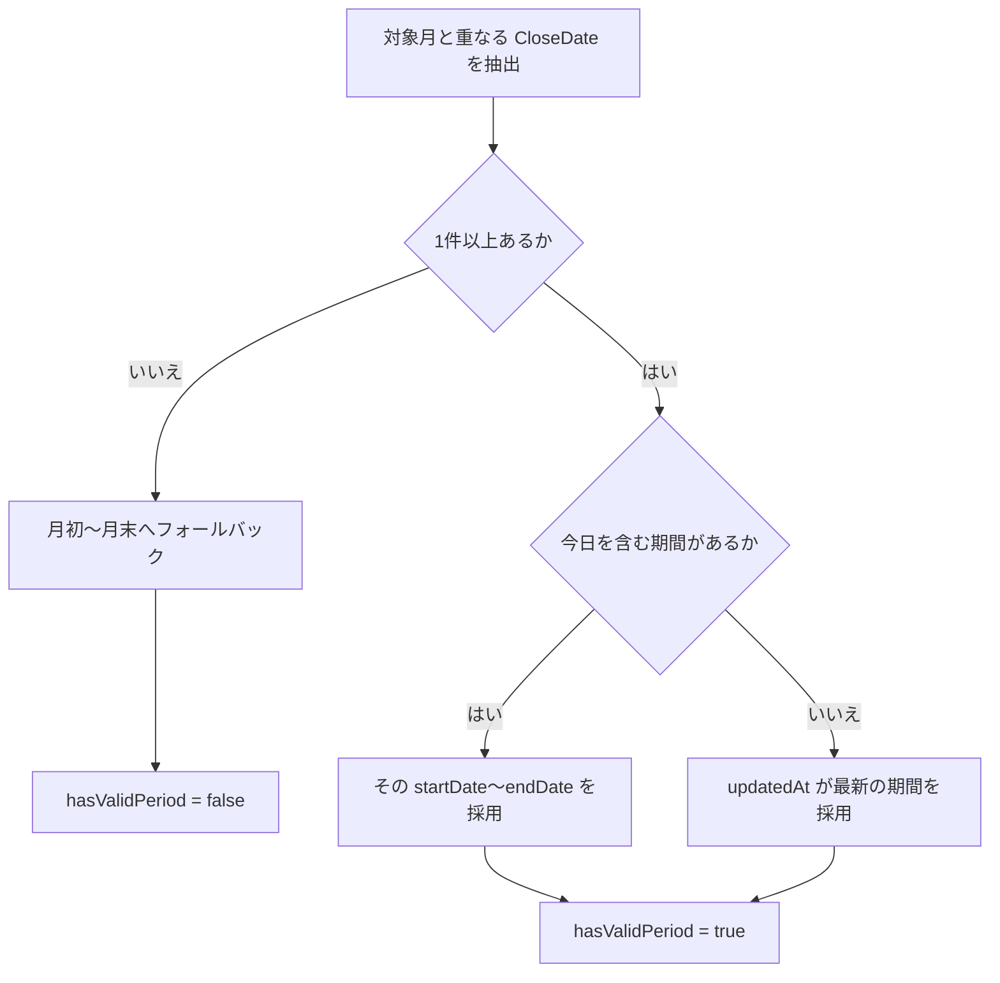

# 締め日 (CloseDate) システム仕様

勤怠の集計対象期間は、`CloseDate` を基準に決定する。`CloseDate` が未設定の月は月初から月末へフォールバックする。

## データ構造

`CloseDate` の実体は次の項目で扱う。

- `closeDate`: 締め日（例: 2026-04-24）
- `startDate`: 集計開始日（例: 2026-03-25）
- `endDate`: 集計終了日（例: 2026-04-24）
- `updatedAt`: 更新日時（同一月に複数設定がある場合の優先度判定で使用）

主な参照実装:

- `src/features/attendance/list/ui/attendanceListUtils.ts`

## 有効集計期間の決定: `getEffectiveDateRange()`

対象月に紐づく `CloseDate` 群から、画面集計に使う 1 期間を決める。

### 判定ルール

1. 対象月と重なる `CloseDate` が存在しない場合:
   - 対象月の `月初〜月末` を採用
   - `hasValidPeriod` は `false`
2. `CloseDate` が存在し、その期間内に「今日」が含まれる場合:
   - その `startDate〜endDate` を採用
   - `hasValidPeriod` は `true`
3. 上記 2 に該当しない場合:
   - `updatedAt` が最新の `CloseDate` を採用
   - `hasValidPeriod` は `true`

## クエリ範囲の拡張: `getAttendanceQueryDateRange()`

UI 表示月だけでなく、締め期間が月境界をまたぐケースを取得漏れなく扱うため、API クエリ範囲を次で決める。

- `queryStart = min(対象月の月初, effectiveDateRange.start)`
- `queryEnd = max(対象月の月末, effectiveDateRange.end)`

これにより、例として「前月 25 日〜当月 24 日」の締め期間でも、必要データを一括取得できる。

## 一括登録の初期値

締め日一括登録フォームの既定値は次の通り。

- `startMonth`: 現在月の月初
- `closingDay`: `31`
- `monthCount`: `6`
- `adjustDirection`: `"previous"`
- `considerWeekend`: `true`
- `considerHolidayCalendar`: `true`
- `considerCompanyHolidayCalendar`: `true`

主な参照実装:

- `src/features/admin/jobTerm/ui/JobTermBulkRegister.tsx`

## 締め日候補月の生成

新規作成候補として、次を重複除去して利用する。

- 現在月から 12 ヶ月先まで
- 既存 `CloseDate` の登録月

主な参照実装:

- `src/features/admin/jobTerm/lib/common.ts`

## 休日考慮の締め日調整

締め日が休日（土日・祝日・会社休日）に当たる場合、設定に応じて締め日をずらす。

- 調整方向: 前倒し (`previous`) または後ろ倒し (`next`)
- 調整上限: 最大 90 日探索
- 指定日が存在しない月（例: 2 月 31 日）は、その月の月末を基準にする

## 関連仕様

- データ取得期間の一覧: [機能別データ取得期間](./data-fetch-periods.md)
- 打刻エラー表示仕様: [打刻エラー一覧の表示仕様](./attendance-error-list-display.md)
