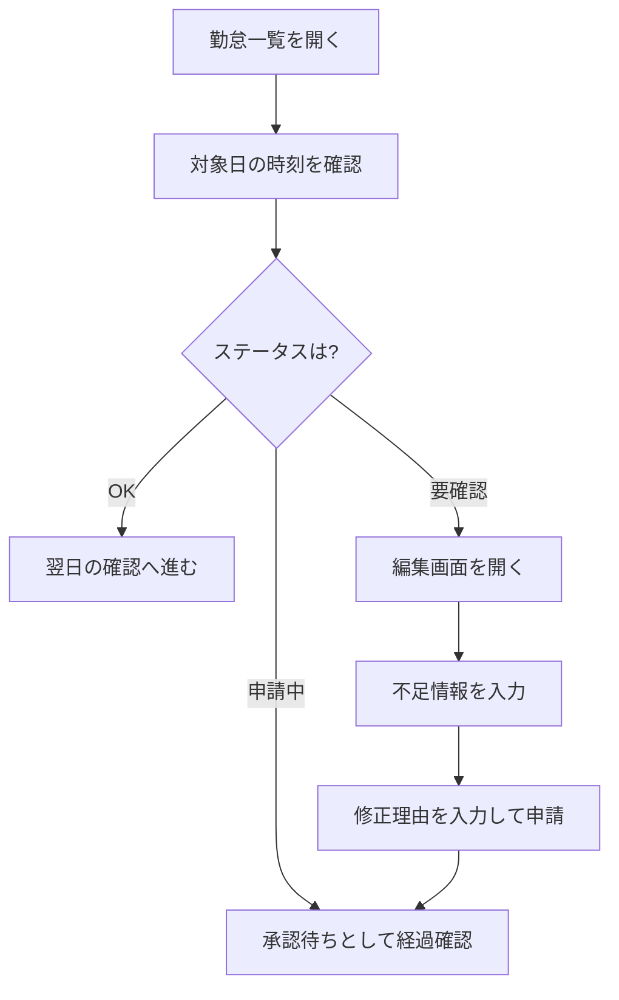

# 勤怠を確認する

このページでは、打刻後の勤怠確認と、必要時の修正申請の流れを説明します。

勤怠確認では、まず月全体を見て OK と要確認の日を把握し、その後に対象日を開いて確認します。

一覧に表示される OK・要確認・申請中・表示なし の意味をまとめて確認したい場合は、[勤務ステータスの見方](../work-status-overview) を参照してください。

## 確認の基本方針

- 当日分は退勤後に確認する
- 過去分は要確認や申請中の有無を優先して確認する
- 月次締め前は対象期間をまとめて確認する

## 手順

1. 勤怠一覧を開く
1. 対象日を選び、開始時刻・終了時刻・休憩時間を確認する
1. 勤怠判定ステータス（OK・要確認・申請中・表示なし）を確認する

記録がそろっている日は `OK` が表示され、そのまま次の日の確認へ進めます。

不足や不整合がある日は `要確認` が表示され、対象日を開いて内容を確認します。

## 確認フロー図

以下は、日次確認時の判断ポイントをまとめたフローです。

## 日次確認の操作例

1. 退勤後に当日行を開く
1. 開始時刻・終了時刻・休憩時間の順で確認する
1. 勤怠判定ステータスが要確認なら編集画面へ進む
1. 問題なければ翌日の確認へ進む

## 要確認がある場合

要確認日がある場合は、打刻エラー一覧から修正対象日を絞り込んで順に対応します。

1. 対象日の編集画面を開く
1. 不足している時刻や休憩情報を入力する
1. 修正理由を入力して申請する

参照: [勤怠を修正する](./attendance-edit)

## 月次締め前の確認例

1. 対象月の一覧を開く
1. 要確認と申請中を先に抽出して対応する
1. 全営業日の出勤・退勤の欠落がないか確認する
1. 修正申請の承認状態を最終確認する

## 確認タイミングの目安

- 当日退勤後
- 翌営業日の始業前
- 月次締め処理の前
