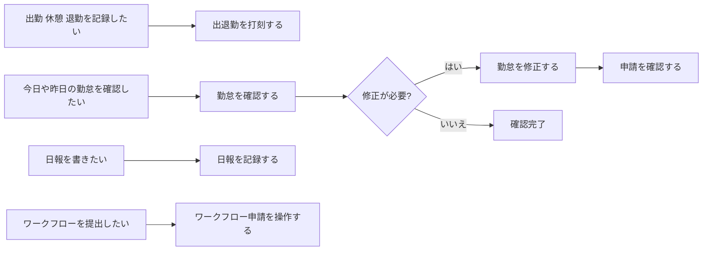

# 画面遷移マップ（スタッフ向け）

迷ったときに、目的から行き先を決めるためのページです。

## 目的から選ぶ

| したいこと                   | 開くページ                                  | 完了の目安                   |
| ---------------------------- | ------------------------------------------- | ---------------------------- |
| 出勤、休憩、退勤を記録したい | [出退勤を打刻する](./time-recording.md)     | 時刻が正しく表示される       |
| 今日や昨日の勤怠を確認したい | [勤怠を確認する](./attendance-check.md)     | 開始、終了、休憩が確認できる |
| 打刻ミスを直したい           | [勤怠を修正する](./attendance-edit.md)      | 申請中または承認済みになる   |
| 申請の進み具合を見たい       | [申請を確認する](./request-check.md)        | 最新の状態が分かる           |
| 日報を書きたい               | [日報を記録する](./attendance-report.md)    | 下書き保存または提出できる   |
| ワークフローを提出したい     | [ワークフロー申請を操作する](./workflow.md) | 提出後に状態が確認できる     |

## 導線フロー図

目的ごとの最短導線を図で確認したい場合は、以下を参照してください。

## 最短ルート

### 出勤前

1. 打刻画面を開く
1. 出勤を打刻する
1. 必要なら勤怠一覧で確認する

### 打刻を間違えた

1. 勤怠一覧で対象日を開く
1. 時刻を修正して申請する
1. 申請の状態を確認する

### 申請が戻ってきた

1. コメント内容を確認する
1. 指摘された内容を修正する
1. 再提出して状態を確認する
